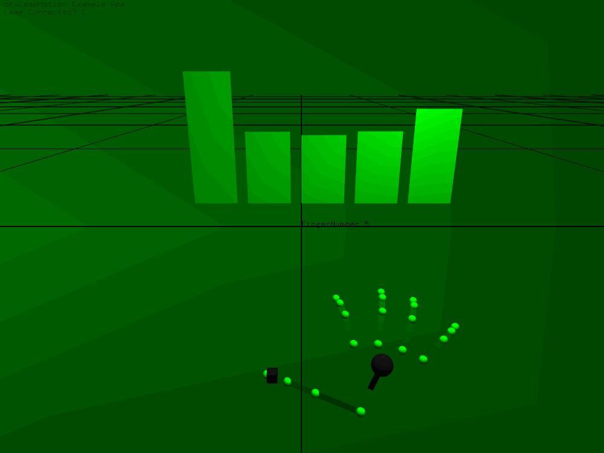

# Betech_Code

Some OpenFrameworks Example Written During the Internship of Betech Digital CO,.LTD

## Base Requirement

* OSX 10.10.5
* Xcode 7.2.1
* OpenFrameworks 0.9.3 release

## Projects' Requirement & Preview

1. 20161020_ofxLeapMotion2
	* Addon: [ofxLeapMotion2](https://github.com/genekogan/ofxLeapMotion2)

		

2. 20161021_ofxLeapMotionParticles
	* Addon: [ofxLeapMotion2](https://github.com/genekogan/ofxLeapMotion2)
		
		
	

3. 20161024_ofxLeapMotionGesture
	* Addon: [ofxLeapMotion2](https://github.com/genekogan/ofxLeapMotion2)

		

		
		
4. 20161025_ofxLeapMotionGestureMap
	* Addon: [ofxLeapMotion2](https://github.com/genekogan/ofxLeapMotion2)

		
		
5. 20161027_oops
	* Example for ofBook's OOPs! chapter & translate comment to chinese.

6. 20161028_oops
	* Example for ofBook's OOPs! chapter & translate comment to chinese.

7. 20161110_moveTracker
	* Example for making diff pixels to black or white.
		
		

		
		
8. 20161110_moveTrackerUsingOpenCV
	* Example for making diff pixels to black or white using OpenCV.

		
		
		
			
9. 20161114_WhitePixelsCounter
	* Example for making diff pixels to black or white using OpenCV.
	* Added white pixels counting feature.

		
	
10. 20161114_blobsAnalysis
	* Example for making diff pixels to black or white using OpenCV.
	* Added white pixels counting feature.
	* Added blobs analysis using ofxOpenCv function: ofxCvContourFinder.
		
		
		
11. 20161114_blobsAnalysisBgSelect
	* Example for making diff pixels to black or white using OpenCV.
	* Added white pixels counting feature.
	* Added blobs analysis using ofxOpenCv function: ofxCvContourFinder.

		
		
12. 20161115_opencvHaarFinder
	* Example for making face tracking

		

